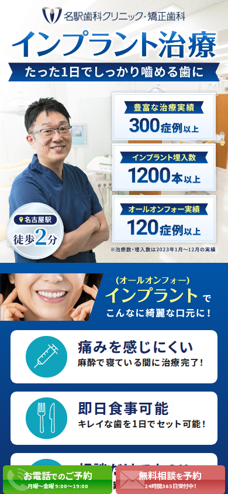
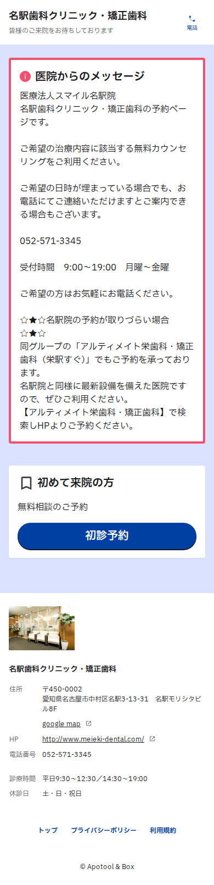

# 現LP 診断レポート

対象：https://www.meieki-dental.net/all_on_4_004/
確認日：2026年9月30日
確認方法：スマホ（iPhone相当 390×844）とPC（1366×860）で表示し、全文と画像の代替テキストを抽出。Web予約（Apotool & Box）の入口ページも確認（予約は送信していません）。

---

## 1. 結論

**「来た人の悩み（オールオン4）に最初の画面で答えていない」「ページが長すぎて料金・予約まで届かない」「予約システムの入口で取りこぼしている」** の3点が、コンバージョンを下げている最大の要因です。
あわせて、**医療広告ガイドライン上リスクの高い表現（患者の体験談など）** が複数あり、広告審査や行政指導で集客が止まるリスクがあります。

### 残すべき良い点
- スマホ下部の追従ボタン（電話／Web予約）
- 集計期間つきの実績数値（300症例以上・埋入1,200本以上・オールオン4 120症例以上）
- 理事長・院長・**麻酔医**の顔写真と経歴、**麻酔専門医の常駐**・全身麻酔対応
- **10年保証**（半年ごとの定期検診が条件）、**CT撮影つきの無料相談**、治療前の総額説明、医療費控除の案内
- **LINEの小冊子プレゼント**（まだ予約する気がない検討層の受け皿として有効）
- GTM（`GTM-TKQ2RFV`）が導入済み

---

## 2. 問題点（影響の大きい順）

### ① 最初の画面が「インプラント治療」で、オールオン4の広告と一致していない【最重要】
- 見出しは「インプラント治療／たった1日でしっかり噛める歯に」。「オールオン4」は2画面目に小さく「（オールオンフォー）」と出るだけ
- 最初の画面に **料金も予約ボタンもない**（追従バーのみ）
- 見出し・実績・特長がすべて **画像の中の文字**。広告キーワード別の出し分けができず、文字拡大や読み上げにも対応できない（画像59枚中43枚が代替テキストなし）

### ② ページが長すぎて、料金・予約まで届かない
スマホで **縦に約37画面分（31,000px）**。料金が出てくるのは **20画面目（ページの52%地点）** です。

| セクション | 出てくる位置（スマホ） |
|---|---|
| オールオン4の説明 | 6画面目 |
| ザイゴマインプラント | 10画面目 |
| 1本からのインプラント | 12画面目 |
| 当院の特徴 | 15画面目 |
| **治療費** | **20画面目** |
| 患者さまの声 | 28画面目 |
| 治療の流れ | 31画面目 |
| よくある質問 | 34画面目 |

オールオン4を検討している人に、**1本インプラントの説明（N1システム、X-Guideなど）が3画面以上** 続きます。3つのプランを1ページに詰め込まず、オールオン4専用にすべきです（ザイゴマは「骨が少ない方の選択肢」として短く触れる程度に）。

### ③ Web予約の入口で取りこぼしている

- LPの「無料相談を予約」→ 予約システム（Apotool & Box）の入口ページに移動しますが、**最初の画面は医院からの注意書きで埋まり、「初診予約」ボタンはスクロールしないと見えません**
- 注意書きに **「名駅院の予約が取りづらい場合は、別医院を検索しHPよりご予約ください」** とあり、広告費をかけて連れてきた人を Google 検索へ送り出しています
- LPの文脈（オールオン4の相談）が予約システム側に引き継がれない
- 予約が外部サイトで完了するため、**広告に「予約完了」が正しく戻っていない可能性**があります（LP側で計測できるのはボタンのクリックまで。GTMの設定を要確認）

→ 予約システムの医院メッセージを2〜3行に短くし、別医院の案内は削除するか、直接リンクにしてください（Apotool の管理画面で編集できます）。改善版LPでは **ページ内で完結する3ステップの予約フォーム** で予約を受け付けます（→ 5章）。

### ④ 医療広告ガイドライン上のリスクが高い表現
医療機関のウェブサイトは広告規制の対象です。以下は、広告審査落ち・行政指導の原因になり得ます。

| 現在の表現 | 問題 | 修正案 |
|---|---|---|
| **患者さまの声**（手書きの感想4件。氏名・年齢入り、記入日は平成24年＝2012年） | 治療内容・効果に関する**体験談は広告できません**。しかも14年前のもの | **セクションごと削除**（口コミは Google ビジネスプロフィールなど医院外で） |
| 「麻酔で寝ている間に治療完了！」「麻酔で寝ている間に完了できる！」「麻酔で眠っている間に終了」 | 静脈内鎮静法は「半分眠っているような状態」（本文でも自ら説明）。当日は仮歯までで**治療は完了しない** → 誤認のおそれ | 「静脈内鎮静法で、うとうとした状態で手術を受けられます」 |
| 「これら全てのお悩みを解決できます！」「どのようなご状況であっても大丈夫です！」「歯が残ってなくても治療可能！」 | 断定・誇大 | 「〜のお悩みに、オールオン4が選択肢になります」「お口の状態により治療できない場合もあります」 |
| 「骨造成などの手術も必要ないため」 | 断定（必要な場合もある） | 「骨造成が不要になる場合があります」 |
| 「仮歯装着後、いつも通りの食事や会話を楽しむことができます」 | 不正確（仮歯の期間は硬い物を避ける） | 「仮歯の装着後、やわらかいお食事から始められます」 |
| 「生涯にわたってインプラントを使っていくことはできます」 | 断定 | 「定期的なメンテナンスで、長くお使いいただけます」 |
| 「世界TOPブランド」「一番質が高い『N1インプラント』」 | 最上級表現 | 「ノーベルバイオケア社のN1システムを使用」 |
| 「激安インプラントは大丈夫？」「他院より難症例のご紹介多数！」 | 他院との比較を想起させる | 削除、または「他院で難しいと言われた方もご相談ください」 |
| 「たった1日で全ての歯を新しく治療する」（見出し） | 注記はあるが、見出しだけ読むと最終的な歯まで1日で入ると誤認 | 「手術当日に、固定式の仮歯が入る」 |
| オールオン4の口元の **術前・術後写真** | 治療内容・費用・期間・リスクの説明が同じ場所にない | 4項目を写真の直下に併記、または掲載を見送る |
| リスク・副作用の記載がない（「公的保険適用外」のみ） | 自由診療の広告に必要な情報が不足 | 手術に伴うリスク・副作用の一覧を掲載 |
| 麻酔医メッセージ「間違いなく素晴らしいです」 | 主観的な最上級表現 | 該当文を削除 |

### ⑤ 料金が税抜表示のみ
「1,750,000円（税別）」「290,000円（税別）」の表示のみです。自由診療は消費税の課税対象のため、一般の方向けの価格は **税込の総額表示が必要** です（2021年4月から義務化）。
→ **「1,925,000円（税込）」**（税抜1,750,000円）と表示してください。

### ⑥ 情報が古い
- 実績数値が **2023年** の集計（今は2026年）→ 最新年の数字に更新
- 患者さまの声が **2012年** 記入（④で削除推奨）

### ⑦ 誤字・表示崩れ
| 場所 | 現在 | 正しくは |
|---|---|---|
| 治療の流れ STEP05 | 約30分**$301C**3時間ほど（画面にそのまま表示されている） | 約30分〜3時間ほど |
| 当院の特徴 | インプラント**生入** | 埋入 |
| 分割払い | ご都合に**会わせて** | 合わせて |
| オススメする理由 | 治療期間を大幅に**縮小** | 短縮 |
| 同上 | 改善することが**できため** | できるため |
| ページタイトル・説明文 | 「1日で完了するオールオンフォー」 | 「手術当日に仮歯が入るオールオン4」（完了はしない） |

また、理事長メッセージが矯正歯科の内容（「美しい歯並びを目指しましょう」）になっており、インプラントのページと合っていません。

### ⑧ 医療費控除の説明が不正確
「実質的に1割近く税金が控除されます」は所得によって大きく異なります。改善版LPでは、所得税率を選ぶと戻る金額の目安がわかるシミュレーターにしました。

---

## 3. 今すぐ現LPでできる応急処置（改善版の公開までに）

1. **患者さまの声を非表示**にする（④）
2. **「寝ている間に治療完了」などの表現を修正**する（④の表）
3. **料金を税込で併記**する（⑤）
4. **誤字を修正**する（⑦。特に `$301C` は画面にそのまま表示されています）
5. **予約システムの医院メッセージを短くし、別医院の検索案内を削除**する（③）
6. 実績数値を最新年に更新する（⑥）

---

## 4. 改善版LP（`lp/`）での対応

| 現LPの課題 | 改善版での対応 |
|---|---|
| 最初の画面が「インプラント治療」 | 「手術したその日に、固定式の歯で食事ができる。」＋オールオン4＋**料金（税込）と月額**＋予約ボタンを最初の画面に。広告キーワード別に見出しを出し分け（入れ歯／費用／骨が少ない／痛みが怖い） |
| 3プランで長すぎる | オールオン4専用に絞り、ザイゴマは「骨が少ない方の選択肢」として紹介 |
| 料金が20画面目 | 最初の画面と、4〜5画面目の費用セクションに表示 |
| 予約システムの入口で離脱 | ページ内で完結する3ステップのフォーム |
| 体験談・断定表現 | 体験談なし。リスク・副作用を明記し、表現をガイドラインに沿って修正 |
| 税抜表示 | 税込表示（税抜額を併記） |
| 画像の中の文字 | すべてテキストで作成（文字拡大・読み上げ・出し分けに対応） |
| 現LPの良い点 | 実績数値、麻酔医の常駐、10年保証、CT撮影つき無料相談、医師3名の顔写真と経歴、LINEの小冊子プレゼントを引き継ぎ |

---

## 5. 予約の受け方について

現在は予約システム（Apotool & Box）で、空いている日時をその場で予約する方式です。改善版LPでは次の2つを切り替えられます。

| 方式 | 長所 | 短所 |
|---|---|---|
| **A. LP内の3ステップフォーム**（標準） | ページを離れずに完了でき、入力の負担が小さい。広告の流入元も記録でき、成約データを広告に戻せる | 予約リクエストのため、医院から電話で日時を確定し、予約システムに入力する手間がある |
| **B. 予約システムへ直接送る** | 空き枠がその場で確定し、予約台帳に自動で入る | 外部サイトに移動するため、入口での離脱が起きやすい。予約完了を広告に戻しにくい |

**→ A（LP内の3ステップフォーム）に決定しました。** 改善版LPはフォームのみで予約を受け付けます。届いた予約リクエストは電話で日時を確定し、予約システム（Apotool）に登録します（手順は [`reception-manual.md`](reception-manual.md)）。

---

## 6. 計測について

- GTM（`GTM-TKQ2RFV`）が入っており、Meta（Facebook）の計測タグも動いています
- 改善版LPには同じ GTM を設定済みです（本番のドメインでのみ動作し、確認用のプレビューやテストでは送信されません）。**予約完了の計測を追加する手順**は [`measurement-setup.md`](measurement-setup.md) を参照してください
