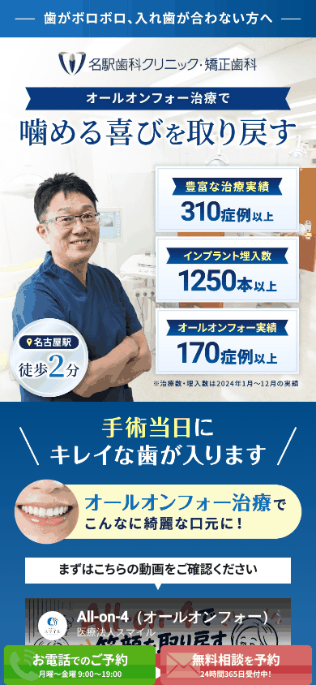
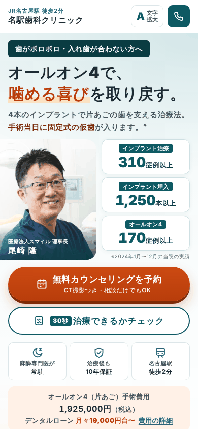

# Meta広告用LP（all_on_4_006）診断と改善版

対象：https://www.meieki-dental.net/all_on_4_006/ （Meta 広告＝Instagram・Facebook からの流入先）
確認日：2026年10月6日
確認方法：Instagram のアプリ内ブラウザと同じ条件（iPhone、幅390×844）で表示し、全文・画像・通信量を確認。Web予約の入口も確認（予約は送信していません）。

| 現在のLP（006） | 改善版（`lp-006/`） |
|---|---|
|  |  |
| 画像1枚。予約ボタンは画面下の追従バーだけ | 同じ「医師の写真＋実績」に、予約ボタン・適応チェック・料金を追加。文字はすべてテキスト |

---

## 1. 結論

006 は 004（検索広告用）より「オールオン4」に絞られ、動画や実績も入って良くなっています。それでも、**Meta 広告から来る人に合っていない点が3つ**あり、広告費の割に予約が増えにくい状態です。

1. **重い**：最初の表示で **約10MB** を読み込みます（画像 5.8MB、Webフォント 2.2MB、YouTube 1.0MB など）。Instagram・Facebook のアプリ内ブラウザでは、表示を待たずに戻る人が多くなります
2. **予約までが遠い**：最初の画面に予約ボタンがなく、ページは **約36画面分**。料金は **19画面目**。予約ボタンを押すと外部の予約システムに移り、そこでも離脱します
3. **医療広告ガイドライン上のリスク**：説明のない **術前・術後写真4組**、2012年の **手書きの体験談**、「寝ている間に治療完了」「これら全てのお悩みを解決」「東海エリアトップクラス」などが残っています。広告審査や行政指導で配信が止まるおそれがあります

改善版LP（`lp-006/`）では、この3点を解消したうえで、**Meta 広告の特性（ふと目にした人が、その場で興味を持つ）に合わせた導線**を作りました。

---

## 2. 006 で良くなった点（残すもの）

- オールオン4に特化した見出し・ボタン（004 は「インプラント治療」）
- メインビジュアルに **医師（理事長）の写真と実績**（310症例・1,250本・オールオン4 170症例、2024年の実績）
- 解説動画（「All-on-4で笑顔を取り戻す」）
- 「上記の費用は手術料のみ。別途麻酔や上部構造等の諸費用が掛かります」の明記
- 予約システムへ移るときに広告クリックID（gclid・fbclid など）を引き継ぐスクリプト
- LINE の小冊子プレゼント、追従ボタン（電話／予約）、GTM（Meta ピクセルも動作）

---

## 3. 問題点（影響の大きい順）

### ① 表示が重い【最重要】
| 読み込むもの | 量 |
|---|---|
| 医院の画像など（`meieki-dental.net`） | 5.8MB（メイン画像 0.7MB、LINEバナー画像 1.4MB ほか） |
| Webフォント（Google Fonts） | 2.2MB |
| YouTube の埋め込み（2画面目で自動的に読み込み） | 1.0MB |
| GTM・Meta ピクセルなど | 0.9MB |
| **合計** | **約10MB** |

画像に遅延読み込み（`loading="lazy"`）がないため、下の方の画像も最初にすべて読み込みます。モバイル回線のアプリ内ブラウザでは、ここがいちばん大きな損失です。

### ② 最初の画面に予約ボタンがなく、ページが長い
- 最初の画面は **画像1枚（文字も画像の中）**。予約ボタンは追従バーだけ
- ページは約36画面分（30,400px）

| セクション | 出てくる位置（スマホ） |
|---|---|
| 動画 | 1〜2画面目 |
| 術前・術後写真（ここまで変わります） | 4画面目 |
| オールオン4の説明 | 5画面目 |
| ザイゴマインプラント | 9画面目 |
| 1本からのインプラント | 11画面目 |
| 当院の特徴 | 14画面目 |
| **治療費** | **19画面目** |
| 医師紹介 | 22画面目 |
| 患者さまの声 | 26画面目 |
| 治療の流れ | 30画面目 |
| よくある質問 | 32画面目 |

### ③ 予約が外部の予約システムで完結する
- 予約ボタンは予約システム（Apotool & Box、`reservation.stransa.co.jp`）へ移動します。最初の画面は医院からの注意書きで、「初診予約」はスクロールしないと見えません（[004 の診断](current-lp-review.md) の③と同じ）
- 予約完了は予約システム側の別の GTM（`GTM-P4HQSF4F`）で計測されるため、**Meta 広告に「予約完了」が正しく戻っているかが不明**です。Meta はこの数字で配信先を学習するので、戻っていないと「予約しそうな人」に配信されません

### ④ 医療広告ガイドライン上のリスク
| 現在の表現 | 問題 |
|---|---|
| **術前・術後写真4組**（「当院の治療でここまで変わります！」）、オールオン4の術前・術後写真 | 治療内容・費用・期間・リスクが同じ場所にないため、掲載できない（限定解除の要件を満たさない） |
| **患者さまの声**（手書きの感想4件、記入日は平成24年＝2012年） | 治療内容・効果に関する体験談は掲載できない |
| 「麻酔で寝ている間に治療完了！」「麻酔で眠っている間に終了」 | 当日は仮歯まで。静脈内鎮静法は「うとうとした状態」で、誤認のおそれ |
| 「これら全てのお悩みを解決できます！」「どのようなご状況であっても大丈夫です！」 | 断定・誇大 |
| 「東海エリアトップクラスの症例数」 | 根拠を示せない比較表現 |
| 「世界TOPブランド」「一番質が高い」 | 最上級表現 |
| 「骨造成などの手術も必要ない」「いつも通りの食事」「生涯にわたって」 | 断定・不正確 |
| 「激安インプラントは大丈夫？」「他院より難症例のご紹介多数！」 | 他院との比較を想起させる |
| リスク・副作用の記載なし | 自由診療の掲載に必要な情報が不足 |

### ⑤ 料金が税抜表示のみ
「1,750,000円（税別）」のみ。税込（**1,925,000円**）の表示が必要です。

### ⑥ 誤字・HTMLの不具合
- 「約30分**$301C**3時間」（画面にそのまま表示）、「インプラント**生入**」、「ご都合に**会わせて**」、「治療期間を大幅に**縮小**」、「Reserve**rd**」
- メイン画像の説明文が「**葉**がボロボロ」（読み上げ・検索で使われます）
- LINEバナー6か所が **見出し（h1）と閉じていない section** で囲まれている（ページに h1 が7個）
- 理事長メッセージが矯正歯科の内容（「美しい歯並びを目指しましょう」）

---

## 4. Meta 広告から来る人の特徴と、改善版LPの設計

検索広告（004）は「オールオン4 費用」などを**自分で調べている人**が来ます。Meta 広告（006）は、Instagram・Facebook を見ていて**たまたま広告を目にした人**が来ます。

| | 検索広告（004） | Meta 広告（006） |
|---|---|---|
| 来る人 | 今まさに調べている | まだ比較検討していない。興味を持ったばかり |
| 見ている環境 | ブラウザ | アプリ内ブラウザ（遅い回線でも開く・すぐ戻る） |
| 最初に必要なもの | 答え（価格・できるか） | 広告と同じ見た目（「さっきの広告だ」）と、興味を深める入口 |
| いきなり予約する人 | 多い | 少ない → **小さな一歩（チェック・LINE）を用意** |

### 改善版LP（`lp-006/`）での対応

| 課題 | 改善版での対応 |
|---|---|
| 重い（約10MB） | **最初の表示 約285KB**（計測タグを除く）。画像は必要になってから読み込み、Webフォントは使わず端末の日本語フォントで表示。動画はタップされるまで YouTube を読み込まない。Lighthouse（モバイル）パフォーマンス **95〜97** |
| 最初の画面に予約ボタンがない | 広告と同じ「歯がボロボロ・入れ歯が合わない方へ／噛める喜びを取り戻す／理事長の写真／実績」に、**予約ボタン・30秒チェック・料金（税込）・安心材料**を追加（幅375×667でも予約ボタンと実績が最初の画面に入る） |
| いきなり予約する人が少ない | **30秒の適応チェック**（4問）。回答に合わせたアドバイス（骨が少ない／手術が怖い／費用／年齢・持病／期間／ご家族）を出し、**回答をそのまま予約フォームに引き継ぐ**。まだ迷う人には LINE の小冊子 |
| 3プランで長い（36画面） | オールオン4に絞り、ザイゴマは「骨が少ない方の選択肢」として紹介（約26画面。追従ボタンでいつでも予約へ） |
| 料金が19画面目 | 最初の画面に料金（税込）と月額。費用セクションで内訳・分割・医療費控除シミュレーター |
| 外部の予約システムで離脱 | **ページ内で完結する3ステップの予約フォーム**（004 の改善版と共通。受付手順は [`reception-manual.md`](reception-manual.md)） |
| Meta に予約完了が戻っているか不明 | 予約完了ページで `reservation_complete`（**event_id つき**）を送信。受信スクリプトから **Meta のコンバージョンAPI** にも同じ event_id で送れる（二重計上されない）。広告クリックID（fbclid／fbc／fbp）を予約台帳に記録 → [`measurement-setup.md`](measurement-setup.md#7-meta広告instagramfacebookの計測) |
| 術前・術後写真 | 現LPの写真4組を **症例セクションにセット済み**。治療内容・費用・期間の **空欄を記入した症例だけが自動で表示** される（空欄が残っている症例は公開しても表示されない） |
| 体験談・断定表現 | 体験談なし。リスク・副作用を明記。表現をガイドラインに沿って修正 |
| 税抜表示 | 税込表示（税抜額を併記） |

---

## 5. 公開までの手順（006）

1. **内容の確認**：料金・実績（2024年）・医師情報は現LPの掲載内容です。HTML内の `【要確認】` `【要更新】` を確認
2. **予約フォームの受け皿**：004 と同じ受信スクリプト（予約台帳）を使えます（[`server/gas/README.md`](../server/gas/README.md)）。`lp/assets/js/main.js` の `CONFIG.formEndpoint` を設定 → `npm run sync:006` で `lp-006/` にも反映。予約台帳の「流入ページ」で 004／006 を区別できます
3. **空欄の記入**：下の「6. 医院で記入する空欄」を記入（[下書き](../preview/lp-006-draft.html) で黄色の枠の位置を確認できます）。空欄が残っている項目は公開しても表示されないので、記入できたものから順に出せます
4. **アップロード**：`lp-006/` フォルダの中身を、サーバーの `all_on_4_006/` に上書きアップロード（今の `all_on_4_006/` はバックアップしておく。今の画像フォルダ `assets/img/` のファイルは消さずに残しても問題ありません）
5. **Meta の計測**：[`measurement-setup.md` の7章](measurement-setup.md#7-meta広告instagramfacebookの計測) の手順で、ピクセルの Lead を `reservation_complete` に、event_id を設定。可能ならコンバージョンAPIも
6. **広告**：広告の文言・見出しパターンの使い分けは [`meta-ads.md`](meta-ads.md)
7. **公開後**：スマホの Instagram アプリから広告（またはプレビュー）を開き、テスト予約を1件。予約台帳・通知メール・完了ページ・イベントマネージャの Lead を確認

> 新LPの準備ができるまでの間は、今の 006 の問題だけを直した **応急処置版**（[`current-lp-hotfix/006/`](../current-lp-hotfix/006/)）に差し替えられます。

---

## 6. 医院で記入する空欄

改訂LPは、医院でしかわからない情報を **空欄（黄色の枠）** にしてあります。
- **下書き**：[`preview/lp-006-draft.html`](../preview/lp-006-draft.html)（1ファイルで開けます。黄色の枠が空欄。画面左下の「次の空欄へ」で順に移動）
- **記入のしかた**：`lp-006/index.html` の `…` を、タグごと実際の内容に書き換えます（例：`約　か月` → `約6か月`）。書き換えたら `npm run sync:006` で下書きも更新
- **公開時の動き**：空欄が1つでも残っている項目（症例1件ごと・費用の行ごと など）は、自動で非表示になります。記入できたものから順に表示されます

| 場所 | 空欄 | 記入する内容 | 記入しないと |
|---|---|---|---|
| オールオン4とは（イラスト） | ノーベル・バイオケア社の All-on-4® イラスト、同社指定のクレジット表記 | **同社から提供・使用許諾を受けた画像** を `lp/assets/img/` に置き、空欄を `` に書き換える（手順は `lp-006/index.html` のコメント）。同社のイラストは著作物のため、同社のWebサイトやパンフレットから許諾なく転載することはできません。ノーベル・バイオケア・ジャパンの営業担当者に、医院向けの患者説明用素材（使用許諾つき）を依頼してください | 当院作成の図解を表示（記入すると自動で切り替わる） |
| 治療例（症例1〜4） | 上あご／下あご、年代・性別、お悩み、治療内容、治療期間・通院回数、費用（税込・総額） | 写真の患者さまの実際の内容。**治療内容・費用・期間がそろわないと、術前・術後写真は掲載できません**（医療広告ガイドライン） | その症例は表示されない |
| 費用の内訳 | 静脈内鎮静法、全身麻酔、上部構造（最終的な歯）、手術当日の仮歯、総額の目安 | 片あごの税込の目安。「別途」の金額がわかると、総額への不安が減ります | その行は表示されない（全部空欄なら表ごと非表示） |
| デンタルローン | 最大の分割回数 | ローン会社の最大回数（例：120）。費用カードと「よくある質問」の2か所 | 回数は表示しない |
| 治療の流れ・よくある質問 | 標準的な治療期間（か月）・通院回数 | ご相談から最終的な歯の装着までの標準。自由診療の掲載で求められる情報です | 表示しない |
| 医師の紹介 | 理事長のメッセージ | インプラント治療への思い・患者さまへの一言を2〜3文（今の006のメッセージは矯正歯科の内容のため） | メッセージ欄を表示しない |
| 予約 | 初回の所要時間（分） | CT撮影・ご説明を含む初回カウンセリングの時間 | 表示しない |
